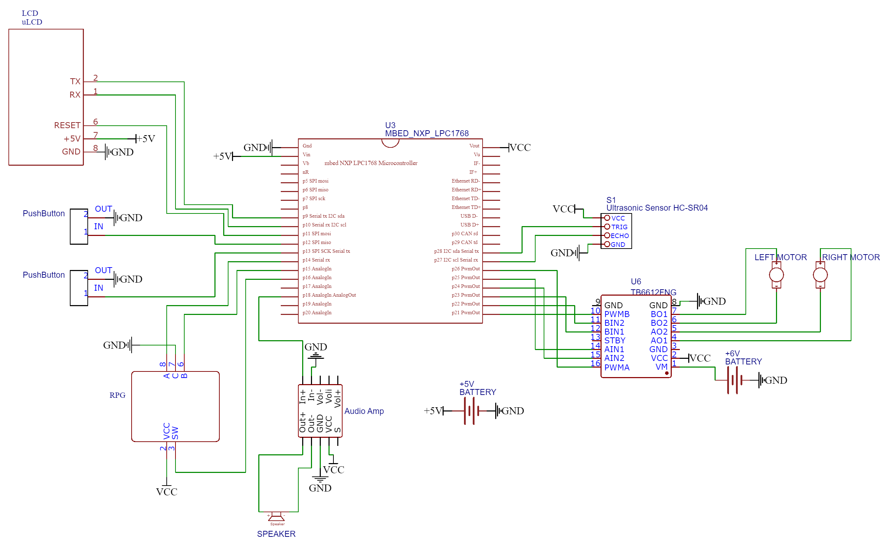

# Alarm Robot
Alarm that will drive around your room and force you to get up and turn it off.

### Joseph Lucas
### Bronson Zell


## Wiring and Hardware Setup
### Parts:
1. Mbed microcontroller LPC1768
2. Rotary Pulse Generator
3. Dual H-Bridge TB6612FNG
4. uLCD-144-G2
5. Speaker
6. Class D Audio Amplifier TPA2005D1
7. Ultrasonic Sensor HC-SR04
8. AA Batteries with battery packs
9. Two mini DC motors
10. Two pushbuttons

### Setup
Follow the wiring schematic given to correctly hook up all the parts. Keep in mind that the motors require their own battery pack due to current limitations.
Without sufficient current or voltage the Mbed will fail to start up or continue to power cycle. The speaker quality is pretty poor, it would do much better with a PWM pin but they were all used up by the motors.
Simply set your current time and desired alarm time. The robot will activate when those are equal. Time is in 24h format.


## Wiring Schematic


## Video Demo
[Link to Youtube Video Demo](https://www.youtube.com/watch?v=_B4wL1TXFJc)

## Software 

#### Libraries

```c++
#include "mbed.h"
#include "rtos.h"
#include "ultrasonic.h"
#include "uLCD_4DGL.h"
#include "PinDetect.h"
#include "motordriver.h"
```
The project included multiple libraries to allow for easier use of hardware.
The ultrasonic library was used for the sonar and we used it to check for an updated distance value.
We used the uLCD library to print to the screen. PinDetect was used to debounce and set iterrupt routines for the pushbuttons.
Motor driver allowed for easy use of the motors connected to a dual H-bridge with PWM control. 
The RTOS library allow us to setup multiple threads for each chunk of code to run independently. 

#### Interrupts

The start of our main functions initializes pushbuttons to be debounced and callback to specific functions.
The RPG rotary is also set to call a function on both rising and falling edges of either encoder bit.

```c++
//debounce RPG center pushbutton and other pushbuttons
RPG_PB.mode(PullDown);
RPG_PB.attach_deasserted(&PB_callback);
RPG_PB.setSampleFrequency();
up.mode(PullUp);
up.attach_deasserted(&precisionUp);
up.setSampleFrequency();
down.mode(PullUp);
down.attach_deasserted(&precisionDown);
down.setSampleFrequency();
// generate an interrupt on any change in either encoder bit (A or B)
RPG_A.mode(PullUp);
RPG_B.mode(PullUp);
RPG_A.rise(&Enc_change_ISR);
RPG_A.fall(&Enc_change_ISR);
RPG_B.rise(&Enc_change_ISR);
RPG_B.fall(&Enc_change_ISR);
```

These functions are mainly used to adjust the clock in various settings.
The RPG pushbutton is used to turn off the alarm and cycle through the clock settings. 
There is an intial normal clock mode. Then a mode to set the current hour, then set the current minute, 
then set the alarm hour, and finally the alarm minute. 
An example of adjusting clock values is below.

```c++
if (set_curr_hour)
{
    curr_hour--;
    if (curr_hour >= 24) curr_hour = 0;
    if (curr_hour <= 0) curr_hour = 0;
}
else if (set_curr_min)
{
    curr_min--;
    if (curr_min >= 60) curr_min = 0;
    if (curr_min <= 0) curr_min = 0;
}
else if (set_alarm_hour)
{
    alarm_hour--;
    if (alarm_hour >= 24) alarm_hour = 0;
    if (alarm_hour <= 0) alarm_hour = 0;
}
else if (set_alarm_min)
{
    alarm_min--;
    if (alarm_min >= 60) alarm_min = 0;
    if (alarm_min <= 0) alarm_min = 0;
}
```

The main way we control the system is through threads using the mbed rtos.
The threads include updating the LCD, updating the time, movement of the robot, and playing the speaker. 

#### uLCD thread

The main thread simply pulls the time variables and displays them on the screen.

```c++
uLCD.locate(1, 1);
uLCD.text_width(2);
uLCD.text_height(2);
uLCD.printf("%02d : %02d", curr_hour, curr_min);
```
#### Time thread

The second thread updates the time variables and checks to set the alarm flag.

```c++
curr_min++;
if (curr_min == 60)
{
    curr_hour++;
    curr_min = 0;
}
if (curr_hour == 24)
{
    curr_hour = 0;
}
if (curr_hour == alarm_hour && curr_min == alarm_min && !set_curr_hour 
                && !set_curr_min && !set_alarm_hour && !set_alarm_min) alarm = true;
```

#### Movement thread

The third thread checks if ```alarm == true``` and moves the robot if yes.

```c++
if (alarm)
{
    mu.checkDistance();

    if(turn) left.stop(1);
    else left.speed(0.4);
    right.speed(-0.5);

    left.coast();
    right.coast();
    Thread::wait(100);

}
else
{
    left.speed(0);
    right.speed(0);
}
```
When moving the robot the sonar is used to check for obstacles ahead.
This is done using the ultrasonic library function ```checkDistnace()```.
This functions checks for a change in distance and if that is detected then calls another helper function that was attached 
during initalization.

```c++
void dist(int distance)
{
    if (distance < 300)
    {
        turn = true;
    }
    else
    {
        turn = false;
    }
}
```

This functions checks if the current distance infront of the robot is less than 300 mm.
If this is true then it sets a turn flag.

The turn flag signals the robot to stop moving a wheel to allow it to rotate out the way of the obstacle.

#### Speaker thread

The last thread outputs to a speaker using the D/A AnalogOut. It does this by attaching and detaching a speaker interrupt that sends a signal 
to the class D audio amp.

```c++
if (alarm)
{
    // turn on timer interrupts to start sine wave output
    // sample rate is 500Hz with 128 samples per cycle on sine wave
    Sample_Period.attach(&speaker_interrupt, 1.0/(1000.0*128));
}
else
{
    Sample_Period.detach();
}
```

This speaker helper function sets the D/A pin to a precomputed value.

```c++
if (alarm)
{
    // send next analog sample out to D to A
    speaker = Analog_out_data[i];
    // increment pointer and wrap around back to 0 at 128
    i = (i+1) & 0x07F;
}
else
{
    // this should also be set in the PB callback but this is just in case I suppose.
    speaker = 0;
}
```


